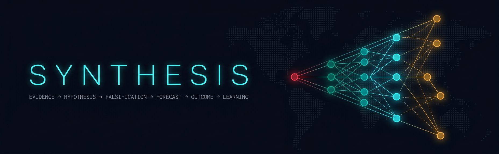

<p align="center">
  
</p>

<p align="center">
  <a href="https://github.com/authorsauravkushwaha/SYNTHESIS/actions"></a>
  
  
  
  
</p>

# SYNTHESIS

**The Evidence-Carrying Causal World Model** — an open platform that turns fragmented
real-world signals into a *temporal causal world graph*:

**entities → events → dependencies → hypotheses → forecasts → observed outcomes.**

SYNTHESIS never asks you to trust the AI blindly. Every conclusion carries its evidence,
its assumptions, its competing explanations, its falsifiers — and a ledger of how often
the model was right before.

> Evidence → Hypothesis → Falsification → Forecast → Outcome → Learning

This repository contains the **MVP vertical slice** (vision §46): five domains
(weather, maritime, energy, infrastructure, trade/economy), a live evidence stream,
impact cones, competing hypotheses, a Falsification Engine, a Contradiction Engine,
counterfactual branching, watchpoints, an Outcome Ledger and calibration — behind an
installable web app that runs on PC and mobile.

---

## 🌐 Website — use it straight from GitHub

**https://authorsauravkushwaha.github.io/SYNTHESIS/** — no install, no server, $0.

Every push to `main` runs [`pages.yml`](.github/workflows/pages.yml): it boots
**two real peered SYNTHESIS nodes**, lets the world evolve for 150 s (watchpoints
fire, contradictions resolve, cross-node reviews complete), freezes the state
into JSON and deploys the console to GitHub Pages. The web client detects the
missing API and switches to STATIC SNAPSHOT mode automatically — same UI, real
engine-produced data, counterfactual branching runs client-side, the evidence
chain export still verifies with the C tool, and the PWA still installs on PC
and mobile. Actions that need a live node (adversarial challenge, peering,
live streams) say so honestly instead of pretending.

> First deployment: the workflow auto-enables Pages. If your org blocks that,
> enable it once under *Settings → Pages → Source: GitHub Actions*.

## Quick start

```bash
pip install -r requirements.txt
uvicorn server.main:app --host 0.0.0.0 --port 8000
# open http://localhost:8000
```

or with Docker:

```bash
docker compose up app        # app only (self-contained MVP)
docker compose up            # + PostGIS & Redis (production-target stores)
```

### Install on PC or phone

SYNTHESIS ships as a **PWA (Progressive Web App)**:

- **Desktop (Chrome/Edge):** open the app → click **⬇ Install app** in the top bar
  (or the install icon in the address bar). It becomes a standalone desktop app.
- **Android:** open in Chrome → menu → **Add to Home screen / Install app**.
- **iOS:** open in Safari → Share → **Add to Home Screen**.

The app shell works offline; live API data is intentionally network-first —
evidence freshness must never be silently faked from a cache.

---

## What the demo shows (the full intelligence loop, §47)

1. **GLOBAL STATE** — live counters, world event map, streaming evidence
   (each record hash-chained on ingestion).
2. **EVENT ANALYSIS** — pick an event (e.g. *Cyclone VARDA-07 → Visakhapatnam*):
   - **Analyze impact** → the **Impact Cone**: every edge labeled
     `observed / strongly supported / plausible / uncertain / contradicted / unknown`
     with mechanism, lag and confidence (hover any edge).
   - **Why?** → click a hypothesis: full evidence trail, counter-evidence,
     mechanism, assumptions. Click any evidence chip to see the raw record —
     including the distinction *“source says X” ≠ “SYNTHESIS infers Y from X”*.
   - **⚔ Challenge this** → the **Adversarial Agent** attacks the hypothesis:
     correlated sources, weak sources, stale data, unverified assumptions,
     live alternatives — and discounts the confidence accordingly.
   - **✕ What would prove this wrong?** → the **Falsification Engine** lists
     falsification conditions and generated watchpoints.
   - **⑂ Branch scenario** → counterfactual simulation (“what if it lasts 24 h /
     7 days? what if recovery is immediate?”) recolors the cone by projected impact.
3. **CONTRADICTIONS** — conflicting sources become first-class objects
   (`UNRESOLVED → PARTIALLY_RESOLVED → RESOLVED`), original evidence preserved.
   Watch `CONFLICT #1043` resolve live as the grid operator's statement arrives.
4. **OUTCOME LEDGER** — open forecasts with countdowns; `forecast_8842` **resolves
   live** a few minutes after server start and is scored into the calibration ledger.
   Reliability diagram + per-sector Brier scores included.
5. **AGENTS** — the least-privilege roster: sandboxed, scoped reads,
   *proposals-only* writes, explicit "cannot" lists.

---

## Live data ingestion (Data Adapter API, §16/§44)

`server/ingest.py` ships real public-data connectors — **USGS earthquakes**
(M6+ auto-become events with templated causal cones & hypotheses) and
**Open-Meteo wind** at watched coastal infrastructure — behind zero-trust rules:

- payload size caps, schema allow-lists, range clamps, hard text truncation;
- external content is stored strictly as **data, never instructions** (§26);
- adapters can only **propose** observations — they cannot write world state;
- unreachable sources are a *normal state* (§51): the platform degrades to
  simulation-only and reports it honestly at `/api/ingest/status` and in the
  **DATA ADAPTERS** panel, never crashes.

## Python SDK (§44)

```python
# PYTHONPATH=sdk/python  (or: pip install -e sdk/python)
from synthesis_sdk import SynthesisClient
c = SynthesisClient("http://localhost:8000")
hyp = c.hypotheses(c.events()[0]["id"])[0]
print(c.challenge(hyp["id"])["verdict"])          # Adversarial Agent
print(c.counterfactual(hyp["event_id"], 24)["narrative"])
ok, n, head = c.verify_chain()                     # client-side, independent
```

Run the whole intelligence loop from code: `PYTHONPATH=sdk/python python3 sdk/python/example.py`

## TypeScript SDK (§44)

`sdk/typescript/synthesis-sdk.ts` — zero-dependency, fully typed, works in
Node 18+, browsers and Deno. Includes `live()` for the realtime WebSocket
channel and `verifyChain()` — independent client-side chain verification via
WebCrypto. The chain now has verifiers in **three languages** (C, Python,
TypeScript): you never have to trust the platform's own arithmetic.

## Realtime channel

`ws(s)://<host>/ws` pushes `world_update` messages (global state + evidence
stream) every 3 s. The channel is **read-only by design** — it accepts no
commands, so a compromised client cannot mutate world state through it (§19).
The web UI uses it automatically and falls back to polling if it drops.

## Federation — SYNTHESIS Protocol v0 (§43)

Nodes keep local data and exchange **Ed25519-signed observation bundles**.
Identity is *proven, never claimed* (`node_id = sha256(pubkey)[:12]`), and the
receiver verifies the signature **before** reading any content. The unique
part — *federation as epistemology, not sync*:

- a peer's claim that **matches** local evidence becomes independent
  **corroboration** (marked `corroborated_by:<node_id>`), never a duplicate;
- a peer's **new** claim enters the local tamper-evident chain with
  `federated:<node_id>` provenance;
- **peer trust is learned, never asserted**: a Laplace-smoothed Beta
  posterior over corroborations (successes) and rejections (failures) sets
  the reliability discount for that peer's future imports — a peer that
  keeps sending unverifiable bundles decays toward ×0.65, a consistently
  corroborated peer caps at ×0.98;
- rejected bundles/items are counted and reported — failure is visible.

Try it in two terminals:

```bash
uvicorn server.main:app --port 8000                                        # node A
SYNTHESIS_NODE_NAME=node-b SYNTHESIS_NODE_SEED=demo-b \
  uvicorn server.main:app --port 8001                                      # node B
curl -X POST localhost:8000/api/federation/peers \
  -H 'Content-Type: application/json' -d '{"url":"http://localhost:8001"}'
```

…or paste the peer URL into the **FEDERATION** panel in the UI. Full wire
format: **[docs/PROTOCOL.md](docs/PROTOCOL.md)**.

## `synthesisctl` — the ops-center in your terminal

Zero dependencies, pure stdlib, works over SSH:

```bash
scripts/synthesisctl status              # global state
scripts/synthesisctl watch               # live dashboard, refreshes every 5 s
scripts/synthesisctl cone evt_3101       # impact cone as a colored causal tree
scripts/synthesisctl challenge hyp_442   # unleash the Adversarial Agent
scripts/synthesisctl fed                 # federation peers + learned trust
scripts/synthesisctl verify              # re-verify the evidence chain locally
SYNTHESIS_URL=https://your-node synthesisctl ledger
```

## API security (§24) — implemented, not just documented

- **Rate limiting**: token buckets per client (240 GET/min, 40 POST/min) → 429
- **Authentication**: set `SYNTHESIS_ADMIN_KEY` and privileged routes
  (federation peer management) require `X-Api-Key` (constant-time compare).
  Unset = demo-open mode — **honestly reported** at `/api/security/status`,
  never silently insecure. Secrets come from the environment, never code.
- **Tamper-evident audit trail**: every privileged call, auth denial and
  rate-limit hit is appended to a hash chain — the *same construction* as the
  evidence chain, verifiable with the *same C tool*:
  `curl -s <host>/api/audit/export | ./tools/ledgercheck/ledgercheck`
- Federation **v0.3**: forecast outcomes reprice peer trust — evidence from a
  peer that keeps backing falsified forecasts mechanically loses weight
  (outcomes count double in the Beta posterior; reality is the strongest
  reviewer).

## Signed releases (§21–22)

Tagging `v*` triggers `.github/workflows/release.yml`: the invariant suite
and cross-language chain verification must pass **before anything is
signed**; then the container is pushed to GHCR with a BuildKit provenance
attestation, an SPDX **SBOM** is generated (syft), and the image digest is
**keyless-signed with Sigstore cosign** (short-lived identity-bound cert,
recorded in the Rekor transparency log). Release notes ship with the
`cosign verify` command — verify before you trust, like everything else here.

## Free to run — everywhere

No paid services anywhere in the stack: free public data feeds (USGS,
Open-Meteo), free CI, free hosting options from your own PC to Hugging Face
Spaces to a phone running Termux. See **[docs/DEPLOY_FREE.md](docs/DEPLOY_FREE.md)**
for seven zero-cost deployment paths and the free-tier scaling table.

## Tests

```bash
python -m pytest tests/ -q     # 17 tests
```

The suite enforces the vision's promises as invariants: chain validity &
tamper detection, every hypothesis falsifiable with watchpoints, evidence
metadata completeness, typed cone edges with stated mechanisms, counterfactual
monotonicity, the Adversarial Agent never *increasing* confidence, forecasts
pinned to model versions, contradictions preserving both claims, and hostile
ingest payloads (including prompt-injection text) neutralized to inert data.

## Implementation status — vision → code

| Vision | Status |
|---|---|
| §5–6 Global state, Impact Cone (typed edges) | ✅ live UI + API |
| §7–8 Competing hypotheses, Falsification Engine | ✅ |
| §9 Contradiction Engine (lifecycle, evidence preserved) | ✅ resolves live |
| §10 Outcome Ledger + calibration (Brier, reliability buckets) | ✅ resolves live |
| §11 Watchpoints — **auto-evaluated**: evidence mechanically moves confidence, traceably | ✅ |
| §12 Counterfactual simulation | ✅ |
| §13–14 Multi-agent roster, Adversarial Agent | ✅ (deterministic agents) |
| §15 Source reliability metadata | ✅ |
| §16 Ingestion pipeline (zero-trust adapters, controlled failure) | ✅ USGS + Open-Meteo |
| §21, §42 Evidence integrity / tamper-evident state | ✅ hash chain, 4 independent verifiers |
| §22 Supply-chain security (SBOM, signing, provenance) | ✅ release workflow |
| §24 API security (rate limits, keys, audit) | ✅ + hash-chained audit trail |
| §25–26 Sandboxing / prompt-injection defense | ✅ data-never-instructions ingest, tested |
| §43 Federation | ✅ protocol v0: signed bundles, learned trust (v0.3), cross-node review (v0.5) |
| §44 SDK / adapters / schemas | ✅ Python + TypeScript SDKs, adapter API, SQL schema |
| §45 Ethical boundary | ✅ decision support only; no autonomous actions anywhere |
| LLM-backed extraction/forecasting agents, RBAC, PostGIS persistence | 🔜 next phase (schema & interfaces ready) |

## Tamper-evident analytical history (§21, §42)

Every evidence record is appended to a hash chain:

```
hash[i] = sha256( prev_hash[i-1] ∥ "|" ∥ payload[i] ),   prev_hash[0] = genesis
```

Export it and verify it **without trusting the platform's own code** — the verifier
is an independent, zero-dependency C program:

```bash
gcc -O2 -o tools/ledgercheck/ledgercheck tools/ledgercheck/ledgercheck.c
curl -s http://localhost:8000/api/ledger/export | ./tools/ledgercheck/ledgercheck
# ✓ chain VALID — 15 records, head 3f9c…
```

or simply `./scripts/verify_chain.sh`. Flip one byte of any payload and the
verifier pinpoints the tampered sequence number. CI re-verifies the chain on
every push (Python writer vs C reader — cross-language integrity check).

---

## Repository layout — deliberately polyglot

Each language does the job it is best at:

| Path | Language | Role |
|---|---|---|
| `server/world.py` | **Python** | Temporal causal world model: evidence chain, impact cones, hypotheses, adversarial agent, counterfactuals, outcome ledger, calibration |
| `server/main.py` | **Python / FastAPI** | API gateway: schema-validated endpoints, security headers |
| `web/app.js` | **JavaScript** | Ops-center client: world map, impact-cone SVG renderer, live feed, ledger |
| `web/index.html`, `web/style.css` | **HTML / CSS** | Installable PWA shell |
| `web/sw.js`, `web/manifest.webmanifest` | **JavaScript / JSON** | Offline shell + install on PC/mobile |
| `server/ingest.py` | **Python** | Zero-trust live data adapters (USGS, Open-Meteo) with controlled failure |
| `server/federation.py` | **Python** | SYNTHESIS Protocol v0: Ed25519-signed federated observation exchange |
| `sdk/python/` | **Python** | Dependency-free SDK incl. client-side chain verification |
| `sdk/typescript/` | **TypeScript** | Typed SDK: realtime channel + WebCrypto chain verification |
| `tests/` | **Python / pytest** | World-model invariants + hostile-input ingestion tests |
| `docs/VISION.md` | **Markdown** | The full 55-section vision document |
| `db/schema.sql` | **SQL (PostgreSQL + PostGIS)** | Production-target schema for the full data model (§29–31) |
| `tools/ledgercheck/ledgercheck.c` | **C** | Independent tamper-evidence verifier with embedded SHA-256 |
| `scripts/*.sh` | **Bash** | Dev & verification workflows |
| `Dockerfile`, `docker-compose.yml` | **Dockerfile / YAML** | Non-root pinned container, local stack |
| `.github/workflows/ci.yml` | **YAML** | CI: build, smoke test, cross-language chain verification |

## API surface

```
GET  /api/state                      global state counters + chain head
GET  /api/feed                       live evidence stream
GET  /api/events                     active cross-domain events
GET  /api/events/{id}/cone           impact cone (typed causal edges)
GET  /api/events/{id}/hypotheses     competing hypotheses A/B/C
GET  /api/hypotheses/{id}            evidence trail, falsifiers, watchpoints
POST /api/hypotheses/{id}/challenge  Adversarial Agent attack
GET  /api/evidence/{id}              raw evidence record (chained hash)
GET  /api/contradictions             contradiction objects
GET  /api/forecasts | /api/ledger    forecasts + outcome ledger
GET  /api/ledger/export              tamper-evident chain (TSV)
GET  /api/calibration                reliability buckets, sector Brier
POST /api/counterfactual             branch the causal model
GET  /api/agents                     least-privilege agent roster
GET  /api/ingest/status              live data adapter health (LIVE vs SIMULATION)
GET  /api/federation/identity        this node's provable identity
GET  /api/federation/observations    Ed25519-signed observation bundle
GET  /api/federation/status          peers: imported / corroborated / rejected
POST /api/federation/peers           register a peer node (pull-only)
POST /api/federation/sync            manual federation sync
```

Interactive docs at `/docs` (OpenAPI).

## Design principles carried into the code

- **Auditable, not persuasive** — every hypothesis links evidence IDs; the validator
  concept (§28) is embodied by structured responses, never free prose.
- **Data ≠ instructions** — external content is displayed as data; nothing in the
  ingest path is executed.
- **Agents propose, humans decide** — no endpoint performs a real-world action;
  the roster's `cannot` list is explicit.
- **History is append-only** — contradictions resolve *forward*; original claims
  and the evidence chain are preserved.
- **Forecasts stay pinned to model versions** — `causal-0.4.2` is stored with every
  forecast so calibration is honest.
- **Ethical boundary (§45)** — no surveillance, no targeting of individuals, no
  autonomous high-impact actions. Decision support only.

## Roadmap

V1 (this MVP) → V2 real datasets & automated watchpoints → V3 federated nodes →
V4 SDK & open world-model protocol → V5 large-scale historical calibration →
V6 interoperable research ecosystem. See the full vision document.

---

Made by **Saurav Kushwaha**.
